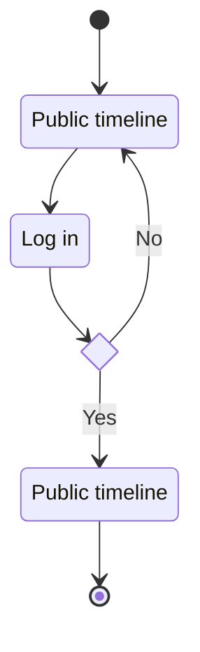

# Log in

```mermaid
stateDiagram-v2
    state "Public timeline" as public
    state "Public timeline" as public2
    state "Log in" as login
    state if_state <<choice>>

    [*] --> public
    public --> login
    login --> if_state
    if_state --> public : No
    if_state --> public2 : Yes
    public2 --> [*]
```

