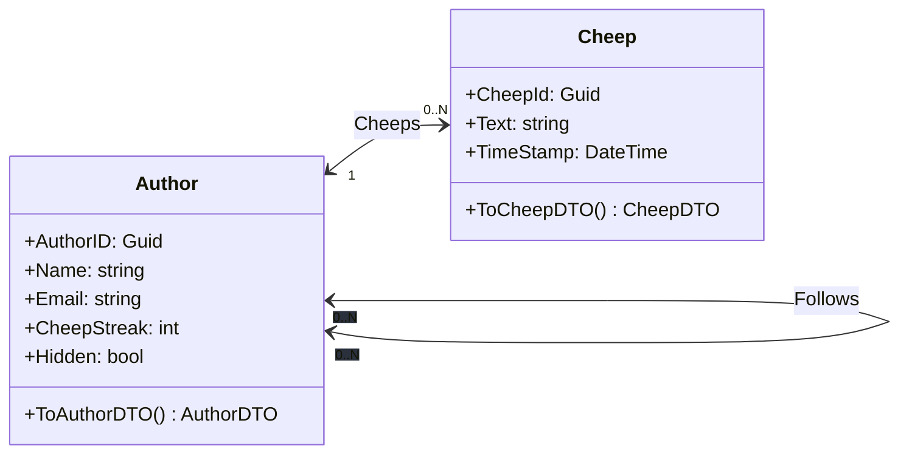
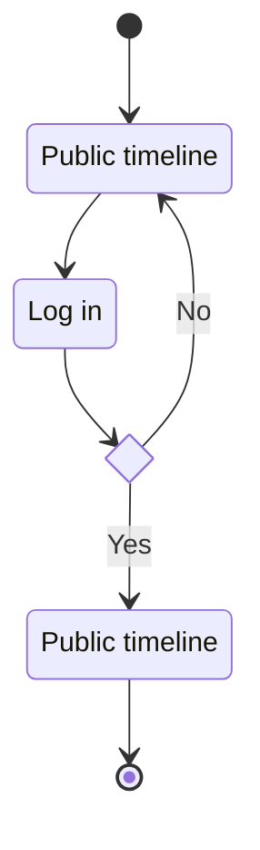
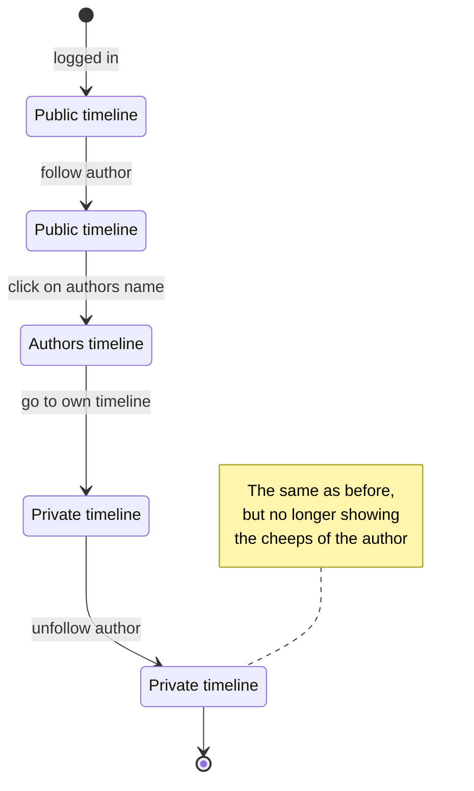
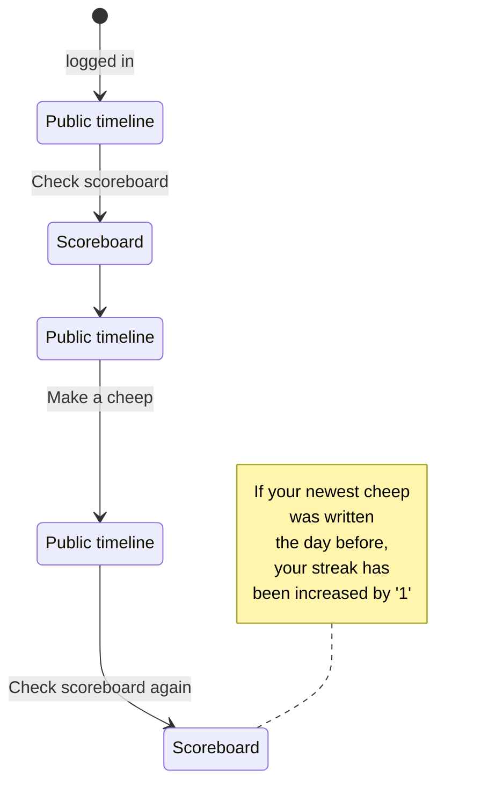
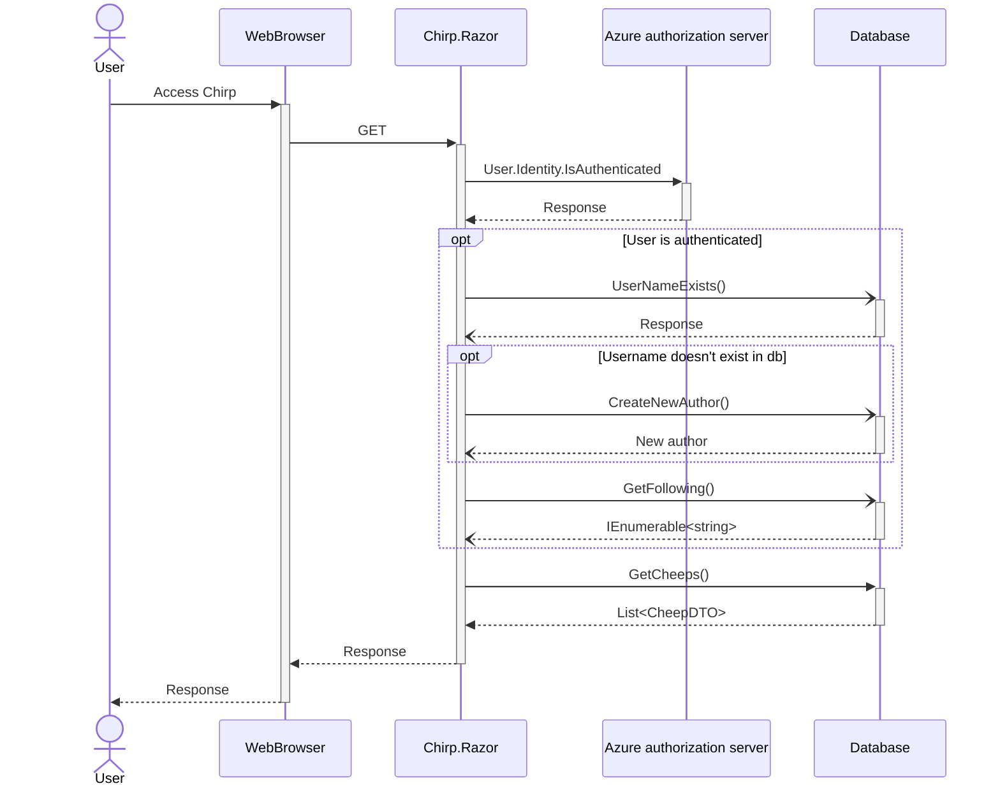
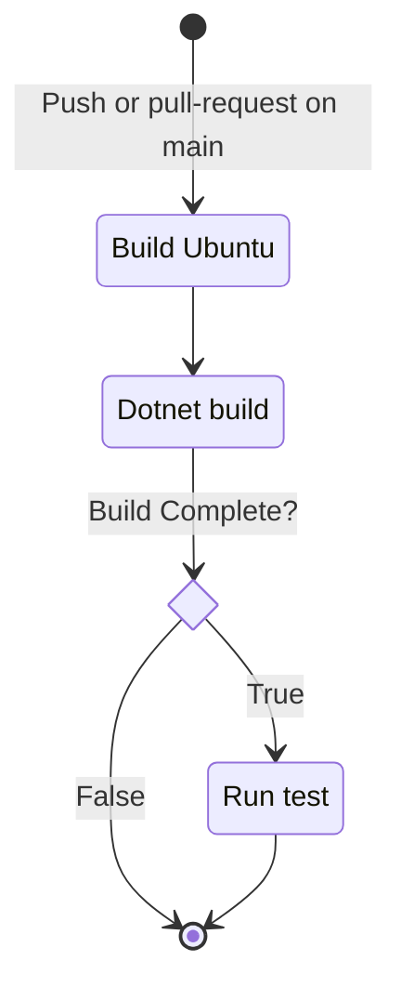

# Design and Architecture of _Chirp!_

## Domain model
Here comes a description of our domain model.




## Architecture — In the small


Here we have chosen some relevant classes, to show our onion architecture.
The most important part to notice here are that dependencies flow inward, ensuring that the inner layers remain independent of the outer layers.
This Makes sure that we try to hold the coupling low between the layers, and makes it more adaptable to change, because we make sure that the outer layers can change without affecting the inner layers.

## Architecture of deployed application

## User activities


### Log in
The following diagram shows the process of signing into Chirp!

UML activity diagram

### Follow and unfollow
The following diagram shows the process of following an author, viewing their timeline, viewing their cheeps on your own timeline and unfollowing the author.


### Adding a cheepstreak
The following diagram shows the process of checking the scoreboard, writing a cheep on the public timeline, and checking the scoreboard again to check whether your streak has increased or not.


## Sequence of functionality/calls trough _Chirp!_

#### Sequence diagram


This sequence diagram shows what happens when a user accesses the web application.

It also shows what happens if the user is authenticated, including what happens if the user hasn't been added to the database yet.

# Process

## Build, test, release, and deployment

### Automatic build and test
Whenever a push is made to main, or a pull request is made, github will build and test our program, to make sure that we do not implement a feature that does not pass all our earlier defined tests.


### Build and deploy to Azure
When a push is made to main, it is automatically deployed to our Azure website. We discussed having the program tested before deploying it to make sure that it would work, but decided not to do that since some of our tests was testing our website directly, which could cause problems.

### Automatic build and release to github
Whenever a tag is pushed with the format v\*.\*.\* it is automatically build, published and released to github, with a zip folder for both windows, macos and linux.


## Team work

## How to make _Chirp!_ work locally
To run our Chirp! locally, the first step is to clone our git repository:
```
git clone https://github.com/ITU-BDSA23-GROUP7/Chirp
```

When the repository is clone, make your way into the `Chirp/src/Chirp.Razor` directory:
```
cd Chirp
cd src
cd Chirp.Razor
```
In this directory you need to set up a user secret containing a connection string to an sql-server using the following command:
```
dotnet user-secrets set "AZURE_SQL_CONNECTIONSTRING" "[insert connection string]"
```
Where `[insert connection string]` is replaced with a connection string refering to an sql server.

When the user secret is made, the program can be run from the same directory using one of the two following commands:
```
dotnet run
```
```
dotnet watch
```

When the program is running you can find it in your browser by following the url in your terminal e.g. `localhost:5000`.

## How to run test suite locally
To test our program run the command:
```
dotnet test
```
from the root of our repository, `/Chirp`

# Ethics

## License
We have chosen the MIT Licence for our application. 

## LLMs, ChatGPT, CoPilot, and others
Through the project, we have used LLM's occasionally. Most of all we used ChatGPT to help us understand different new libraries or architechtures that we needed to use. ChatGPT was occasionally used to help us debug our code. It rarely had a direct influence on what we wrote, and has been co authored whenever this occured.

We used CoPilot once to speed up a task, but has never really used it for anything helpful. CoPilot was co authored as well.