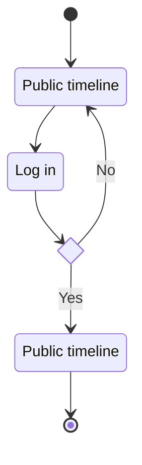

title: _Chirp!_ Project Report

subtitle: ITU BDSA 2023 Group 7

authors:
- Casper <ccaassppeerr2411@gmail.com>
- Line <linejkpraestegaard@gmail.com>
- Max <max@qbrix.dk>
- Daniel Fich <danielfich2@gmail.com>
- Sebastian <hylandersebastian@gmail.com>

numbersections: true


# Design and Architecture of _Chirp!_

## Domain model

Here comes a description of our domain model.


## Architecture — In the small

## Architecture of deployed application

## User activities

## Sequence of functionality/calls trough _Chirp!_

### Log in


UML activity diagram

[log-in.md](log-in.md)

# Process

## Build, test, release, and deployment
```mermaid

```


## Team work

## How to make _Chirp!_ work locally

## How to run test suite locally

# Ethics

## License

## LLMs, ChatGPT, CoPilot, and others