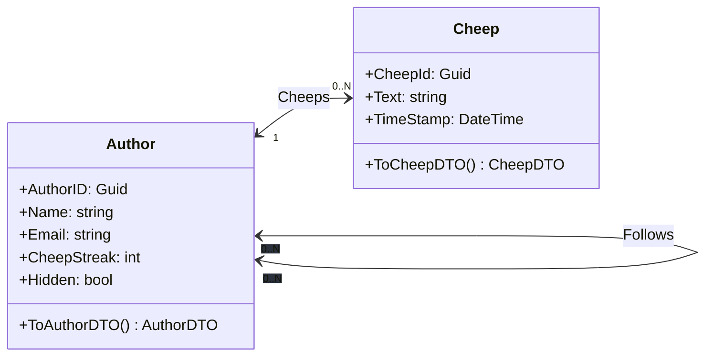
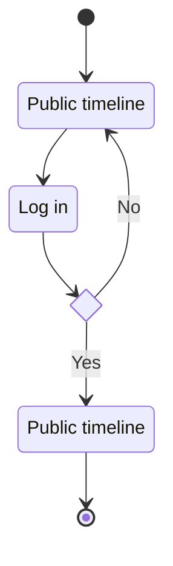
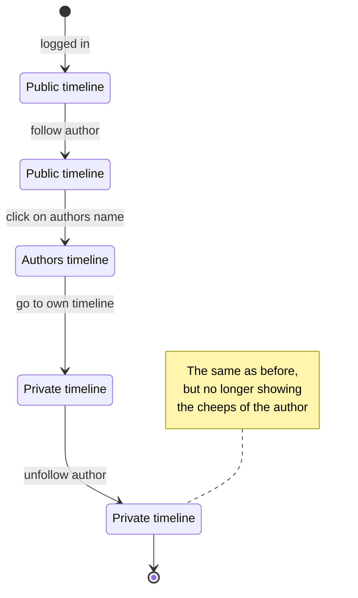
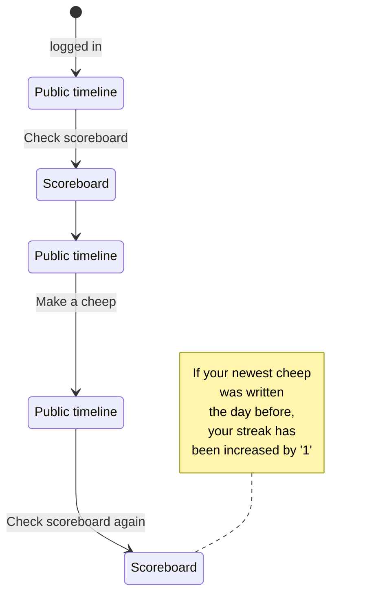
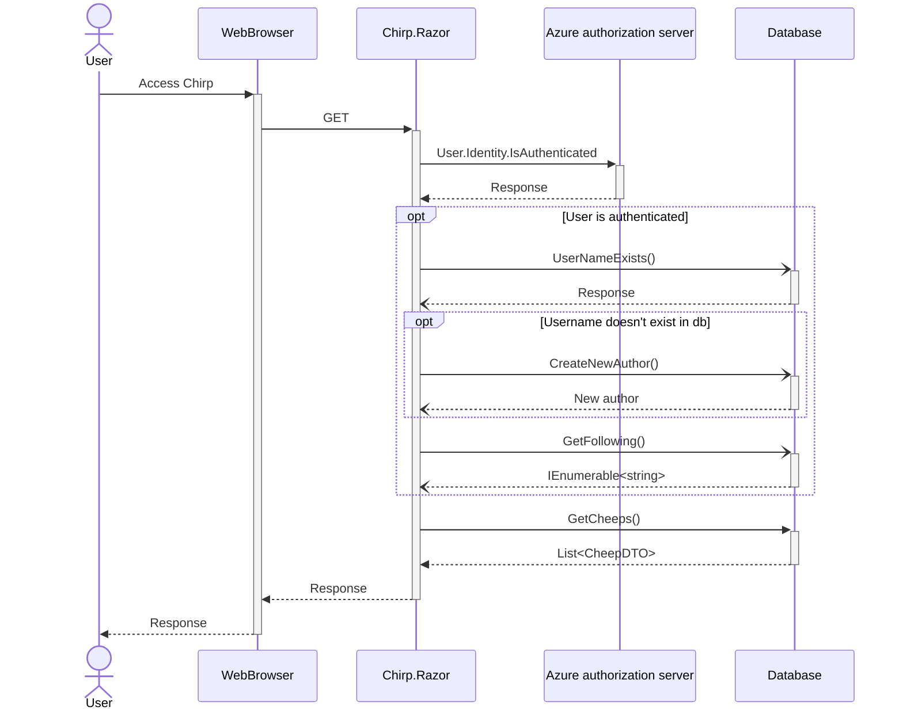
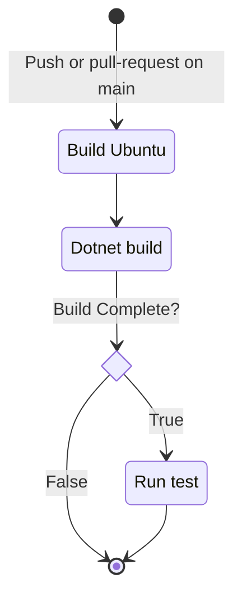
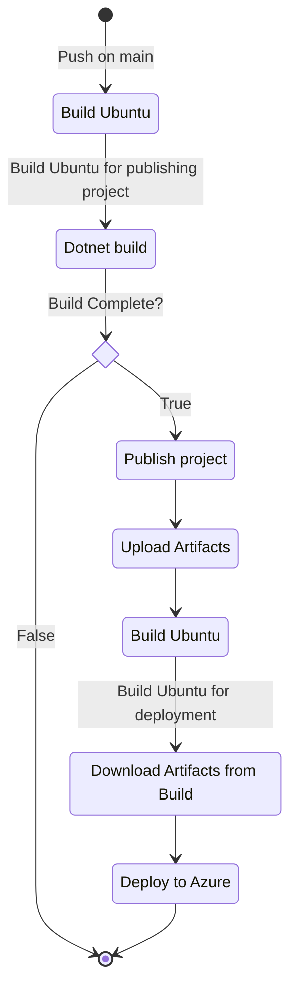
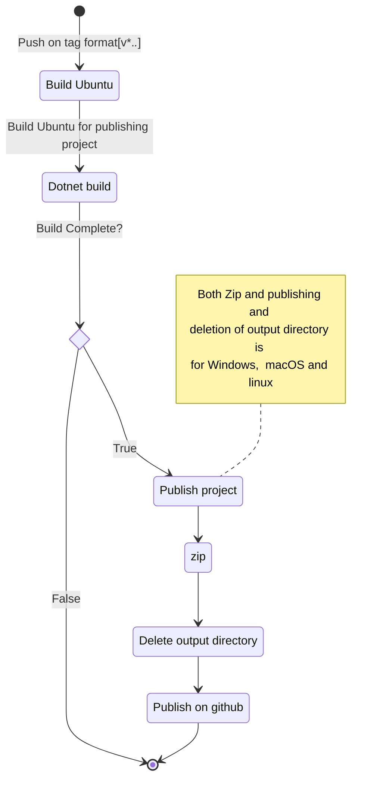
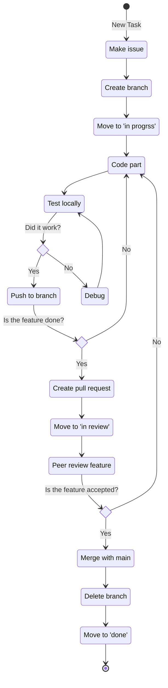

# Design and Architecture of _Chirp!_

## Domain model
Here comes a description of our domain model.




## Architecture — In the small


Here we have chosen some relevant classes, to show our onion architecture.
The most important part to notice here are that dependencies flow inward, ensuring that the inner layers remain independent of the outer layers.
This Makes sure that we try to hold the coupling low between the layers, and makes it more adaptable to change, because we make sure that the outer layers can change without affecting the inner layers.
From the outer layer, the 'program.cs' class can create the razor pages, send it to azure, and also have access to the database.

## Architecture of deployed application
The system has a Client Server architecture, where the web server and web database is hosted via Azure.

it was chosen to show that multible clients can access the web application server at the same time.
## User activities


### Log in
The following diagram shows the process of signing into Chirp! We decided to use ASP.NET identity for our authentication. We decided to do so, to avoid having to gather the information needed directly from the users. Instead ASP.NET indentity allows us to gather the information from the github account of the user that logged in.

UML activity diagram

### Follow and unfollow
The following diagram shows the process of following an author, viewing their timeline, viewing their cheeps on your own timeline and unfollowing the author.


### Adding a cheepstreak
The following diagram shows the process of checking the scoreboard, writing a cheep on the public timeline, and checking the scoreboard again to check whether your streak has increased or not.


### Deleting account
The following diagram shows the process of requesting a deletion of your account, and accepting or rejecting a deletion of the account.
  ```mermaid
stateDiagram-v2
    state "Public timeline" as public
    state "About me" as aboutMe
    state "Forget me" as forgetMe
    state "Public timeline" as public2
    state "Sign out" as signOut


    [*] --> public : logged in
    public --> aboutMe : Go to about me page
    aboutMe --> forgetMe: Request deletion
    forgetMe --> signOut : Yes
    signOut --> public2
    forgetMe --> public2 : No

``` 

## Sequence of functionality/calls trough _Chirp!_

#### Sequence diagram


This sequence diagram shows what happens when a user accesses the web application.

It also shows what happens if the user is authenticated, including what happens if the user hasn't been added to the database yet.

# Process

## Build, test, release, and deployment

### Automatic build and test
Whenever a push is made to main, or a pull request is made, github will build and test our program, to make sure that we do not implement a feature that does not pass all our earlier defined tests.


### Build and deploy to Azure
When a push is made to main, it is automatically deployed to our Azure website. We discussed having the program tested before deploying it to make sure that it would work, but decided not to do that since some of our tests was testing our website directly, which could cause problems.

### Automatic build and release to github
Whenever a tag is pushed with the format v\*.\*.\* it is automatically build, published and released to github, with a zip folder for both windows, macos and linux.



## Team work

### Process of implementing new feature
Here is a diagram of a normal process from having a new feature in mind, to having it made and integrated in our program. It shows, the coding and testing process as well as the issue's state on the projectboard


### Missing features/functionality

The 'Forget me' feature is used by users to delete their accounts. In it's current form in the program the feature flips the boolean 'Hidden' on an Author to be set to true. This means the feature is not deleting anything from our database, but just hiding it on the web application. 
With more time we would have liked to change the feature so it deletes users and their cheeps from the database. This way the feature would be more GDPR compliant, so we won't have to manually delete data from the database if a user requests for their data to be deleted. 


### Project board workflow

In our project board we have 5 columns, 'No status' is the first column, where all new issues end up, and this is where issues stay until we start working on them. 
When a project is being worked on it should be moved to 'In progress', and once ready for review and the pull request is up it is intended to move to 'In review'. Once the pull request is accepted and issue is done, it should be moved to 'Done' and the issue closed. 
We also have the column 'Backlog' which is used for issues that we decided are not a priority, and can be looked at if we have time after doing more pressing issues. 

At first we had more columns in the board, but we deleted these, as we weren't using them, and as such they were just cluttering the board, and making it harder to get a grasp of the issues. 
Much in the same vein we haven't been great at using the 'In review' column, but we decided to keep the column since it's purpose is still relevant.

## How to make _Chirp!_ work locally
To run our Chirp! locally, the first step is to clone our git repository:
```
git clone https://github.com/ITU-BDSA23-GROUP7/Chirp
```

When the repository is clone, make your way into the `Chirp/src/Chirp.Razor` directory:
```
cd Chirp
cd src
cd Chirp.Razor
```
In this directory you need to set up a user secret containing a connection string to an sql-server using the following command:
```
dotnet user-secrets set "AZURE_SQL_CONNECTIONSTRING" "[insert connection string]"
```
Where `[insert connection string]` is replaced with a connection string refering to an sql server.

When the user secret is made, the program can be run from the same directory using one of the two following commands:
```
dotnet run
```
```
dotnet watch
```

When the program is running you can find it in your browser by following the url in your terminal e.g. `localhost:5000`.

## How to run test suite locally
To run our e2e test first download the VSCode extension 'Playwright Test for VSCode', and then enter ">Test: Install Playwright Browsers" into the search bar. When prompted to overwrite the 'playwright.config.ts' file in the terminal select no, by entering 'n'. 
Then open a terminal and run the program.

Open another terminal run the command:
```
dotnet test
```
from the root of our repository, `/Chirp`

# Ethics

## License
We have chosen the MIT Licence for our application. 

## LLMs, ChatGPT, CoPilot, and others
Through the project, we have used LLM's occasionally. Most of all we used ChatGPT to help us understand different new libraries or architechtures that we needed to use. ChatGPT was occasionally used to help us debug our code. It rarely had a direct influence on what we wrote, and has been co authored whenever this occured.

We used CoPilot once to speed up a task, but has never really used it for anything helpful. CoPilot was co authored as well.