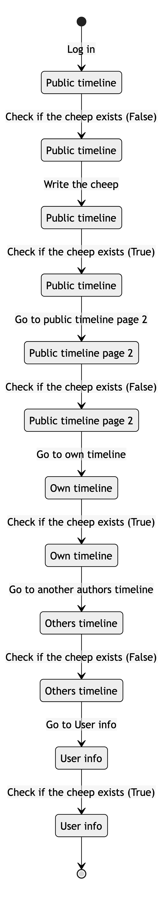

# Design and Architecture of Chirp!

## Domain model

Our domain model consists of the `Author`- and `Cheep` class. Each author can have multiple cheeps and each cheep has a reference to one author. Each author can follow and be followed by multiple other authors.


## Architecture — In the small


Here we have chosen some relevant classes, to show our onion architecture.
The most important part to notice here are that dependencies flow inward, ensuring that the inner layers remain independent of the outer layers.
This Makes sure that we try to hold the coupling low between the layers, and makes it more adaptable to change, because we make sure that the outer layers can change without affecting the inner layers.
From the outer layer, the 'program.cs' class can create the razor pages, send it to azure, and also have access to the database.

## Architecture of deployed application

The system has a Client Server architecture, where the web server and web database are hosted via Azure.


It was chosen to show that multiple clients can access the web application server at the same time.

## User activities

### Unauthenticated user

The following activity diagram shows a typical user journey for an unauthenticated user.


### Log in

The following diagram shows the process of signing into Chirp! We decided to use ASP.NET identity for our authentication. We decided to do so, to avoid having to gather the information needed directly from the users. Instead ASP.NET identity allows us to gather the information from the github account of the user that logged in.


### Follow and unfollow

The following diagram shows the process of following an author, viewing their timeline, viewing their cheeps on your own timeline and unfollowing the author.


### Adding a cheepstreak

The following diagram shows the process of checking the scoreboard, writing a cheep on the public timeline, and checking the scoreboard again to check whether your streak has increased or not.


### Deleting account

The following diagram shows the process of requesting a deletion of your account, and accepting or rejecting a deletion of the account.


## Sequence of functionality/calls trough Chirp!

#### Sequence diagram


This sequence diagram shows what happens when a user accesses the web application.

It also shows what happens if the user is authenticated, including what happens if the user hasn't been added to the database yet.

# Process

## Build, test, release, and deployment

### Automatic build and test

Whenever a push is made to main, or a pull request is made, Github will build and test our program, to make sure that we do not implement a feature that does not pass all our earlier defined tests.


Another important note is that all tests are not run by Github, due to the `--filter` added. This ensures that tests that contain the words `Playwright` or `IntegrationTest` in their [fully qualified name](https://learn.microsoft.com/en-us/dotnet/core/testing/selective-unit-tests?pivots=mstest) are not run. This is due to these tests not always compiling correctly on github.

### Build and deploy to Azure

When a push is made to main, it is automatically deployed to our Azure website. We discussed having the program tested before deploying it to make sure that it would work, but decided not to do that since some of our tests was testing our website directly, which could cause problems.


### Automatic build and release to github

Whenever a tag is pushed with the format `v*.*.*` it is automatically build, published and released to github, with a zip folder for both windows, macos and linux.


## End-2-End testing

In the current implementation of our End-2-End test, it is running via localhost. This means that the database being used is the online Azure Database(It would in the future be favorable to have a local database running in memory instead, to ensure the data has not been manipulated with, and it would ensure more durability for the tests).
Because of this it currently would not be preferable to have tests like for example ones that check for if there exists an unfollow button, due to it not being assured the tests before have not manipulated with the followers.

### Issues with the End-2-End testing

Due to the fact that Chirp! was implemented with B2C authentication via Github, Authentication in End-2-End testing was not easy to implement. This was primarily due to the chance of Github's "device verification" feature would occasionally pop up during testing, which the playwright testing had no way of solving. Because of this the tests have been made with one part without log in, that should work without any problems, and one with logging in, that occasionally fails due to what was mentioned before. We did however prepare some test cases for End-2-End testing, for when we got the log in working, here is a diagram showing one of the test cases we prepared.

The following test case checks if a new cheep shows up on the right pages, and nowhere else. Every time 'the cheep' is mentioned, we check for the specific text defined in the test and the author of the test user:



## Team work

### Process of implementing new feature

Here is a diagram of a normal process from having a new feature in mind, to having it made and integrated in our program. It shows, the coding and testing process as well as the issue's state on the project board


### Missing features/functionality

The 'Forget me' feature is used by users to delete their accounts. In it's current form in the program the feature flips the boolean 'Hidden' on an Author to be set to true. This means the feature is not deleting anything from our database, but just hiding it on the web application.
With more time we would have liked to change the feature so it deletes users and their cheeps from the database. This way the feature would be more GDPR compliant, so we won't have to manually delete data from the database if a user requests for their data to be deleted.

Currently when running our program in a development environment the program will still use the same database as on our production environment. With more time we would have liked to make the development environment run on a separate database, to avoid tampering with the live database when testing and making new features.

### Project board workflow


In our project board we have 5 columns, 'No status' is the first column, where all new issues end up, and this is where issues stay until we start working on them.
When a project is being worked on it should be moved to 'In progress', and once ready for review and the pull request is up it is intended to move to 'In review'. Once the pull request is accepted and issue is done, it should be moved to 'Done' and the issue closed.
We also have the column 'Backlog' which is used for issues that we decided are not a priority, and can be looked at if we have time after doing more pressing issues.

At first we had more columns in the board, but we deleted these, as we weren't using them, and as such they were just cluttering the board, and making it harder to get a grasp of the issues.
Much in the same vein we haven't been great at using the 'In review' column, but we decided to keep the column since it's purpose is still relevant.

## How to make _Chirp!_ work locally

To run our Chirp! locally, the first step is to clone our git repository:

```
git clone https://github.com/ITU-BDSA23-GROUP7/Chirp
```

When the repository is clone, make your way into the `Chirp/src/Chirp.Razor` directory:

```
cd Chirp
cd src
cd Chirp.Razor
```

In this directory you need to set up a user secret containing a connection string to an sql-server using the following command:

```
dotnet user-secrets set "AZURE_SQL_CONNECTIONSTRING" "[insert connection string]"
```

Where `[insert connection string]` is replaced with a connection string referring to an sql server.

When the user secret is made, the program can be run from the same directory using one of the two following commands:

```
dotnet run
```

```
dotnet watch
```

When the program is running you can find it in your browser by following the url in your terminal e.g. `localhost:5000`.

## How to run test suite locally

To run our End-2-End test in the root directory `/Chirp` from the command:

```
npx playwright install
```

Then run the program as described above, because the playwright tests use the program running on localhost.

Open another terminal in the root of our repository, `/Chirp`, run the command:

```
dotnet test
```

# Ethics

## License

We have chosen the MIT License for our application.

## LLMs, ChatGPT, CoPilot, and others

Through the project, we have used LLM's occasionally. Most of all we used ChatGPT to help us understand different new libraries or architectures that we needed to use. ChatGPT was occasionally used to help us debug our code. It rarely had a direct influence on what we wrote, and has been co authored whenever this occurred.

We used CoPilot once to speed up a task, but has never really used it for anything helpful. CoPilot was co authored as well.
